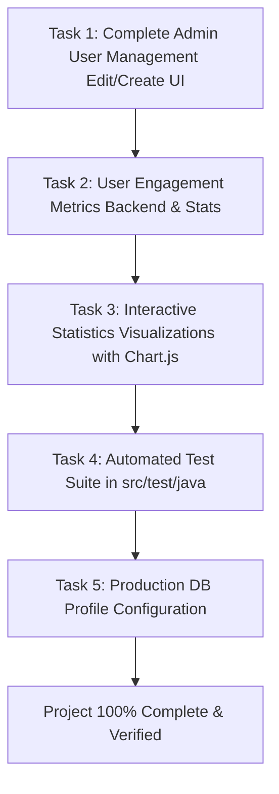

# Job Portal Project Completion Plan

## Overview
This document defines the exact and necessary scope required to bring the Job Portal application to 100% completion based on the official project specification (`job_portal_descrpription.txt`) and technical guidelines (`AGENTS.md`).

All unnecessary out-of-scope enhancements (such as Apache Tika NLP resume parsing, external SMTP mail servers, multi-language i18n, and third-party calendar sync) have been removed. This plan focuses strictly on closing the functional gaps and delivering a robust, production-ready system.

---

## Current Status (~92% Complete)

| Component | Specification Requirement | Current Status |
|---|---|---|
| **Authentication & Roles** | Admin, Employer, Job Seeker authentication & authorization | **100% Complete** (JWT & Spring Security) |
| **Admin Module** | Job approvals, System settings, Real-time activity monitoring | **88% Complete** (Edit user UI & engagement stats missing) |
| **Employer Module** | Job posting CRUD, Applicant review, Candidate messaging, History | **94% Complete** (Chart visualizations missing) |
| **Job Seeker Module** | Search & filters, Application submission, Status tracking, Profile & Resume, Recommendations | **100% Complete** |
| **Testing & CI** | Automated unit & integration tests | **0%** (No test suite in `src/test/java`) |

---

## Remaining Tasks Required for Completion

### Task 1: Complete Admin User Management UI (Edit & Admin Create User)
**Specification Reference**: `job_portal_descrpription.txt` - Admin Functionality 1 & Admin Dashboard 1:
> *"User Management: Table listing user accounts with options for editing and deleting. Input: User details (name, email, role). Output: Confirmation message for successful user creation/update/deletion."*

**Current Gap**:
- The backend `PUT /api/users/{id}` and `POST /api/users` endpoints exist, but the Admin Dashboard table only provides a "Delete" button.
- Admins cannot edit user profiles (name, email, role, headline) directly from the dashboard table.
- "Add User" currently delegates to the public registration modal instead of an administrative provisioning modal.

**Implementation**:
1. **Frontend (`src/main/resources/static/index.html`)**:
   - Add an "Edit User" modal (`adminUserEditModal`) with fields: Name, Email, Role (`ADMIN`, `EMPLOYER`, `JOB_SEEKER`), Headline, Phone.
   - Add a dedicated "Create User" modal (`adminUserCreateModal`) for direct user creation by administrators with role selection.
2. **Frontend Logic (`src/main/resources/static/js/app.js`)**:
   - Add an "Edit" button next to "Delete" in `loadAdminUsers()` table rows.
   - Implement `openEditUserModal(userId)`, `submitAdminUserUpdate()`, and `submitAdminUserCreate()`.
   - Show success/error toast notifications and refresh `loadAdminUsers()` upon completion.

---

### Task 2: Implement User Engagement Metrics
**Specification Reference**: `job_portal_descrpription.txt` - Admin Dashboard 4:
> *"Job Statistics: Graphs and tables showing job postings, application trends, and user engagement."*

**Current Gap**:
- Current admin statistics only count total users by role (`totalUsers`, `totalEmployers`, `totalJobSeekers`, `totalAdmins`).
- User engagement metrics (Daily Active Users, Weekly Active Users, and activity frequencies) are missing from the dashboard stats.

**Implementation**:
1. **Backend Service (`src/main/java/com/company/jobportal/service/`)**:
   - Extend `ActivityLogRepository` with queries for distinct active users within time windows (last 24 hours for DAU, last 7 days for WAU):
     - `countDistinctUserEmailByTimestampAfter(LocalDateTime threshold)`
     - `countByAction(String action)`
   - Extend `DashboardStatsService.getAdminStats()` to calculate:
     - `dailyActiveUsers` (DAU)
     - `weeklyActiveUsers` (WAU)
     - `totalActivitiesToday`
     - Action breakdown (Logins, Job Postings, Applications submitted, Status updates)
2. **Frontend (`src/main/resources/static/js/app.js` & `index.html`)**:
   - Display DAU and WAU cards in the Admin Stats summary grid.
   - Display a User Engagement Breakdown table/chart showing daily activity distribution.

---

### Task 3: Interactive Statistics Visualizations (Chart.js Integration)
**Specification Reference**: `job_portal_descrpription.txt` - Admin Dashboard 4 & Employer Dashboard 5:
> *"Admin: Graphs and tables showing job postings, application trends, and user engagement."*
> *"Employer: Graphs and tables showing application trends and candidate engagement."*

**Current Gap**:
- Current statistics rely solely on basic CSS percentage bars (`.chart-bar-fill`).
- Lacks interactive graphs representing application trends over time and visual distribution.

**Implementation**:
1. **Include Chart.js**:
   - Add Chart.js (v4.x) via CDN script tag in `src/main/resources/static/index.html`.
2. **Admin Dashboard Charts**:
   - **Job Postings & Application Trends Chart** (Line/Bar chart): Applications and job postings over recent periods.
   - **Application Status Distribution Chart** (Doughnut chart): Pending vs Shortlisted vs Accepted vs Rejected.
3. **Employer Dashboard Charts**:
   - **Applicant Funnel Chart** (Bar/Doughnut chart): Interactive visual funnel of candidates.
   - **Applications per Job Posting Chart** (Horizontal Bar chart): Visual applicant volume per open position.

---

### Task 4: Automated Test Suite (`src/test/java`)
**Specification Reference**: `AGENTS.md` - Development Guidelines & Testing Strategy:
> *"Write unit tests for service and controller layers. Unit Tests: Test individual methods in isolation. Integration Tests: Test API endpoints and database interactions."*

**Current Gap**:
- `src/test/java` currently contains 0 test classes. Automated test coverage is required to ensure regression-free builds.

**Implementation**:
1. **Service Layer Unit Tests (`src/test/java/com/company/jobportal/service/`)**:
   - `UserServiceTest`: Test registration, profile update, authentication, and role queries with Mockito.
   - `JobListingServiceTest`: Test job creation, search filters, employer listing queries, approval status updates.
   - `ApplicationServiceTest`: Test application submission, status transitions, duplicate application prevention.
   - `DashboardStatsServiceTest`: Test calculation of admin, employer, and seeker statistics.
2. **Controller Layer Integration Tests (`src/test/java/com/company/jobportal/controller/`)**:
   - `AuthControllerTest`: Test login and registration endpoints with valid and invalid credentials.
   - `JobListingControllerTest`: Test public job search and employer job management.
   - `AdminControllerTest`: Test admin security protection, user deletion, and job approval endpoints.

---

### Task 5: Production Database Profile Configuration
**Specification Reference**: `AGENTS.md` - Technology Stack & Environment Configuration:
> *"Database: MySQL 8.0+ or PostgreSQL 13+. Environment Configuration: application.properties or application.yml"*

**Current Gap**:
- The project only has default in-memory H2 configuration in `application.properties`.

**Implementation**:
1. Create `src/main/resources/application-prod.properties`:
   - Configure MySQL connection string (`jdbc:mysql://localhost:3306/jobportal`), credentials, HikariCP pool settings, and Hibernate dialect.
2. Add profile activation instructions in `AGENTS.md` / `CLAUDE.md`:
   - `mvn spring-boot:run -Dspring-boot.run.profiles=prod`

---

## Action Plan & Execution Sequence

### Execution Checklist
- [x] **Task 1**: Admin User Management UI
  - [x] Add `adminUserEditModal` and `adminUserCreateModal` in `index.html`
  - [x] Add Edit button and edit/create handlers in `app.js`
  - [x] Verify Admin can edit user role/details and create users with direct roles
- [ ] **Task 2**: User Engagement Metrics
  - [ ] Add activity query methods to `ActivityLogRepository`
  - [ ] Update `DashboardStatsService` to compute DAU, WAU, and activity breakdowns
  - [ ] Display engagement KPIs in the Admin Dashboard
- [ ] **Task 3**: Interactive Statistics Visualizations
  - [ ] Include Chart.js in `index.html`
  - [ ] Render interactive charts in Admin Dashboard (`adminStatsCharts`)
  - [ ] Render interactive charts in Employer Dashboard (`employerAnalyticsCharts`)
- [ ] **Task 4**: Automated Test Suite
  - [ ] Implement service unit tests (`UserServiceTest`, `JobListingServiceTest`, `ApplicationServiceTest`, `DashboardStatsServiceTest`)
  - [ ] Implement controller tests (`AuthControllerTest`, `JobListingControllerTest`, `AdminControllerTest`)
  - [ ] Run `mvn test` and ensure all tests pass
- [ ] **Task 5**: Production Database Profile
  - [ ] Add `src/main/resources/application-prod.properties`
  - [ ] Verify clean build with `mvn clean package`